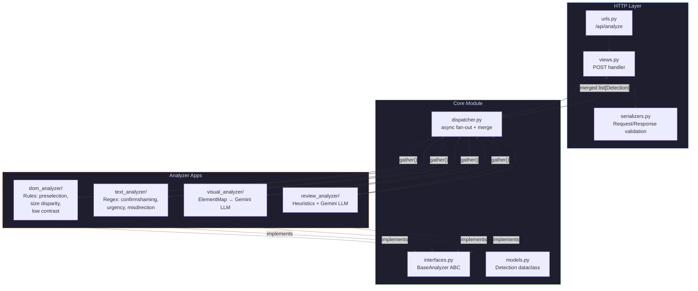
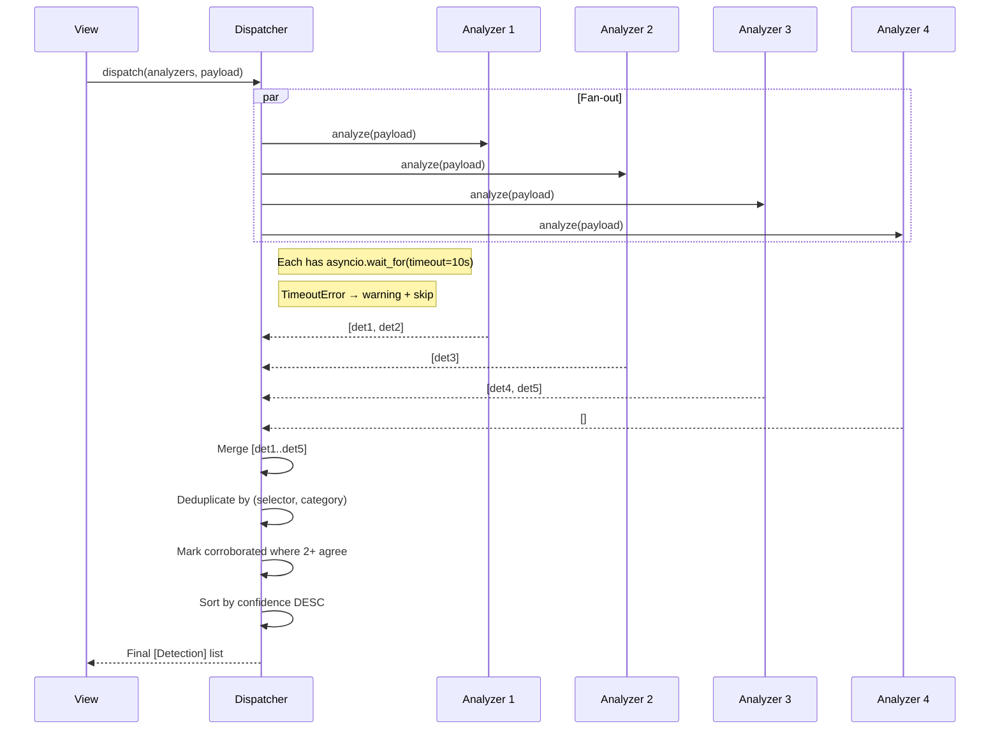

# DarkGuard Backend

> Stateless Django REST API that runs four concurrent dark-pattern analyzers and returns merged detection results.

## Tech Stack

| Component | Technology |
|---|---|
| Framework | Django 5 |
| API | Django REST Framework |
| Concurrency | `asyncio.gather()` with per-analyzer timeouts |
| AI/ML | Google Gemini 2.5 Flash (visual + review) |
| CORS | `django-cors-headers` locked to `chrome-extension://*` |

## Architecture



## Directory Structure

```
backend/
├── darkguard/              # Django project config
│   ├── settings.py         # CORS, DRF, env vars, installed apps
│   ├── urls.py             # Root URL → /api/ prefix
│   └── wsgi.py             # WSGI entry point
├── core/                   # Shared core app
│   ├── interfaces.py       # BaseAnalyzer ABC (async analyze method)
│   ├── models.py           # Detection dataclass (7 fields)
│   ├── serializers.py      # DRF serializers for request/response
│   ├── views.py            # POST /api/analyze endpoint
│   ├── urls.py             # /api/analyze route
│   └── dispatcher.py       # asyncio.gather() orchestrator
├── dom_analyzer/           # DOM dark-pattern rules
│   ├── interfaces.py       # DomPayload, DomElementInfo types
│   ├── service.py          # DomAnalyzerService
│   ├── serializers.py      # DomPayloadSerializer
│   └── tests/              # Unit tests
├── text_analyzer/          # Text/NLP dark-pattern rules
│   ├── interfaces.py       # LabeledElement, TextPayload types
│   ├── service.py          # TextAnalyzerService
│   ├── serializers.py      # TextPayloadSerializer
│   └── tests/              # Unit tests
├── visual_analyzer/        # Visual/layout analysis
│   ├── interfaces.py       # ElementMap, ElementMapEntry types
│   ├── element_map_builder.py  # DOM → ElementMap converter
│   ├── service.py          # VisualAnalyzerService (LLM)
│   ├── serializers.py      # VisualPayloadSerializer
│   └── tests/              # Unit tests
├── review_analyzer/        # Fake review detection
│   ├── interfaces.py       # ReviewPayload type
│   ├── service.py          # ReviewAnalyzerService (LLM + heuristics)
│   ├── serializers.py      # ReviewPayloadSerializer
│   └── tests/              # Unit tests
├── manage.py               # Django management CLI
├── requirements.txt        # Python dependencies
└── pyproject.toml          # pytest config
```

## Setup

```bash
python -m venv .venv
.venv\Scripts\activate          # Windows
# source .venv/bin/activate     # macOS / Linux
pip install -r requirements.txt
cp ../.env.example .env         # Edit with your keys
python manage.py runserver
```

## Environment Variables

| Variable | Default | Description |
|---|---|---|
| `DJANGO_SECRET_KEY` | `insecure-dev-key-change-me` | Django secret key |
| `DJANGO_DEBUG` | `True` | Debug mode |
| `DJANGO_ALLOWED_HOSTS` | `localhost,127.0.0.1` | Allowed host headers |
| `GOOGLE_API_KEY` | *(empty)* | Google GenAI API key (for visual + review) |
| `ANALYZER_TIMEOUT` | `10` | Per-analyzer timeout in seconds |

## Analyzer Contracts

All four analyzers implement `BaseAnalyzer`:

```python
class BaseAnalyzer(ABC):
    @abstractmethod
    async def analyze(self, payload: dict[str, object]) -> list[Detection]: ...
```

Each returns a list of `Detection` dataclass instances:

```python
@dataclass
class Detection:
    category: str           # e.g. "confirmshaming", "preselection"
    element_selector: str   # CSS selector for overlay targeting
    confidence: float       # 0.0 – 1.0
    explanation: str        # Human-readable reason
    severity: str           # "low", "medium", "high"
    corroborated: bool      # True if 2+ analyzers agree (set by dispatcher)
    user_feedback: str | None  # Reserved for feedback loop
```

## Dispatcher Logic



## Testing

```bash
# Set Django settings
$env:DJANGO_SETTINGS_MODULE="darkguard.settings"  # PowerShell
# export DJANGO_SETTINGS_MODULE=darkguard.settings  # Bash

# Run all tests
python -m pytest --tb=short -q

# Run specific analyzer tests
python -m pytest dom_analyzer/tests/ -v
python -m pytest text_analyzer/tests/ -v
python -m pytest visual_analyzer/tests/ -v
python -m pytest review_analyzer/tests/ -v
```

### Test Coverage

| Analyzer | Tests | What's Tested |
|---|---|---|
| DOM | 3 | Pre-checked inputs, clean page empty, confidence bounds |
| Text | 3 | Confirmshaming detection, clean text empty, confidence bounds |
| Visual | 5 | ElementMap builder, empty DOM, clean page, missing DOM, confidence |
| Review | 3 | Generic praise burst, null review empty, confidence bounds |

## Adding a New Analyzer

Use the `/add-analyzer` workflow to scaffold a new analyzer module. Each analyzer must:

1. Be a standalone Django app with its own `service.py`
2. Implement `BaseAnalyzer.analyze()`
3. Return `list[Detection]` with valid categories and `0.0 ≤ confidence ≤ 1.0`
4. Have its own `tests/` directory with at least 3 tests
5. Be registered in `settings.INSTALLED_APPS`
6. Be wired into `core/views.py`'s `_get_analyzers()`
