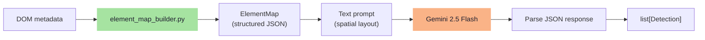
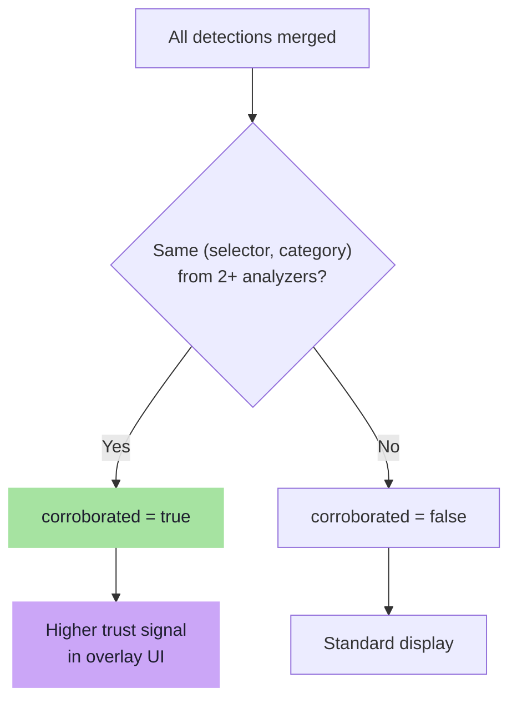

# DarkGuard Analyzers — Deep Dive

> Detailed documentation for each of the four dark-pattern analyzers, including detection rules, confidence scoring, and category taxonomy.

## Dark Pattern Taxonomy

DarkGuard detects patterns across **7 categories**:

| Category | ID | Description |
|---|---|---|
| 🕐 Urgency / Scarcity | `urgency_scarcity` | Artificial time pressure or limited stock claims |
| 😢 Confirmshaming | `confirmshaming` | Guilt-tripping language on decline options |
| 🎨 Visual Interference | `visual_interference` | Contrast tricks, size disparity, low opacity |
| ☑️ Pre-selection | `preselection` | Pre-checked checkboxes/radios |
| 💰 Hidden Costs | `hidden_costs` | Fees revealed late in checkout |
| 🎯 Misdirection | `misdirection` | Misleading button labels or visual hierarchy |
| ⭐ Fake Social Proof | `fake_social_proof` | Fabricated reviews or inflated metrics |

---

## DOM Analyzer

**Module**: `backend/dom_analyzer/`
**Type**: Rules engine (no LLM)
**Timeout**: Subject to `ANALYZER_TIMEOUT` (default 10s)

### Input

The full `payload` dict, accessing `payload["dom_metadata"]`:

```python
{
    "dom_metadata": {
        "hidden_elements": [...],       # Elements with display:none etc.
        "interactive_elements": [...],  # Buttons, links, inputs
        "prechecked_inputs": [...]      # Checked checkboxes/radios
    }
}
```

### Detection Rules

#### 1. Pre-selected Inputs (`preselection`)
- **Trigger**: Any element in `prechecked_inputs[]`
- **Confidence**: `0.85` (fixed)
- **Severity**: `medium`
- **Explanation**: "This checkbox/radio is pre-selected, which may trick users into opting in unintentionally."

#### 2. Button Size Disparity (`visual_interference`)
- **Trigger**: Two interactive elements where `area_ratio > 3.0×`
- **Confidence**: `min(0.5 + (ratio - 3) × 0.1, 0.95)` — scales with disparity
- **Severity**: `medium` if ratio < 5, `high` if ratio ≥ 5
- **Explanation**: "This button is {ratio}× smaller than a nearby button, making it easy to overlook."

```mermaid
graph LR
    A["Button A<br/>300×60px<br/>18,000 sq px"] --- B["Button B<br/>80×14px<br/>1,120 sq px"]
    B -->|"16.1× smaller"| FLAG["⚠️ visual_interference<br/>confidence: 0.95<br/>severity: high"]

    style A fill:#a6e3a1,stroke:#a6e3a1,color:#1e1e2e
    style B fill:#f38ba8,stroke:#f38ba8,color:#1e1e2e
    style FLAG fill:#fab387,stroke:#fab387,color:#1e1e2e
```



#### 3. Low Contrast / Opacity (`visual_interference`)
- **Trigger**: Element with `opacity < 0.4`
- **Confidence**: `0.80` (fixed)
- **Severity**: `medium`
- **Explanation**: "This element has very low opacity ({value}), making it hard to see or read."

---

## Text Analyzer

**Module**: `backend/text_analyzer/`
**Type**: Regex pattern matching
**Timeout**: Subject to `ANALYZER_TIMEOUT`

### Input

Accesses `payload["text_content"]`:

```python
{
    "text_content": {
        "button_labels": [{"selector": "...", "text": "..."}],
        "headings": [{"selector": "...", "text": "..."}],
        "body_text": "..."
    }
}
```

### Detection Rules

#### 1. Confirmshaming (`confirmshaming`)

Scans `button_labels[].text` against 6 regex patterns:

| Pattern | Example Match |
|---|---|
| `no,? i don't want` | "No, I don't want this deal" |
| `no thanks,? i'd rather/prefer` | "No thanks, I'd rather pay full price" |
| `i don't care/like/want (about\|to) save/money` | "I don't want to save money" |
| `i'll pay/stay full price/more` | "I'll pay full price" |
| `no,? i hate saving/money` | "No, I hate saving money" |
| `i prefer not to save` | "I prefer not to save" |

- **Confidence**: `0.85`
- **Severity**: `medium`

#### 2. Urgency / Scarcity (`urgency_scarcity`)

Scans `body_text` against 6 regex patterns:

| Pattern | Example Match |
|---|---|
| `only \d+ left/remaining` | "Only 3 left in stock" |
| `offer/sale expires/ends soon/today` | "Sale ends today!" |
| `hurry/act now/don't miss/limited time` | "Hurry, limited time offer!" |
| `\d+ people viewing/watching` | "47 people are viewing this" |
| `selling/going fast` | "Going fast!" |
| `last/final chance` | "Last chance to buy" |

- **Confidence**: `0.70`
- **Severity**: `low`

#### 3. Misdirection (`misdirection`)

Scans `button_labels[].text` against misleading label patterns:

| Pattern | Explanation |
|---|---|
| `^continue$` | May actually mean 'Subscribe' or 'Accept' |
| `^get started/start now$` | Generic label may hide subscription |
| `^claim/unlock/activate` | May disguise paid commitment |

- **Confidence**: `0.60`
- **Severity**: `low`

#### Future: RoBERTa Integration

```python
# TODO(roberta): Replace regex patterns with a fine-tuned RoBERTa classifier.
# Integration point: load a HuggingFace `transformers` pipeline here.
# The regex rules above should remain as a fast-path fallback.
```

---

## Visual Analyzer

**Module**: `backend/visual_analyzer/`
**Type**: ElementMap → LLM reasoning
**Timeout**: Subject to `ANALYZER_TIMEOUT`
**LLM**: Google Gemini 2.5 Flash

### Pipeline



### ElementMap Structure

The builder converts raw DOM metadata into a structured spatial representation:

```python
@dataclass
class ElementMapEntry:
    selector: str        # CSS selector
    tag_name: str        # HTML tag
    text_content: str    # Visible text
    x: float             # Position X
    y: float             # Position Y
    width: float         # Element width
    height: float        # Element height
    color: str           # Text color
    background_color: str # Background color
    font_size: str       # Font size
    opacity: str         # Opacity value
    area_ratio: float    # element area / viewport area
```

### LLM Prompt

The ElementMap is converted to a structured text prompt that describes each element's position, size, and visual properties — enabling the LLM to reason about layout without seeing raw image data.

### Fallback

When `GOOGLE_API_KEY` is not configured, the visual analyzer returns empty results. DOM-level visual checks are handled by the DOM analyzer instead.

---

## Review Analyzer

**Module**: `backend/review_analyzer/`
**Type**: Heuristics + LLM
**Timeout**: Subject to `ANALYZER_TIMEOUT`
**LLM**: Google Gemini 2.5 Flash

### Input

Accesses `payload["review_text"]` — a string of review bodies separated by `---`.

### Detection Rules

#### 1. Generic Praise Detection (Heuristic)

Scans reviews against 4 generic praise patterns:

| Pattern | Example |
|---|---|
| `great/amazing/excellent product/item` | "Amazing product!" |
| `highly recommend/must buy` | "Highly recommend!" |
| `five stars/5 stars/⭐⭐⭐` | "Five stars!" |
| `exceeded expectations/love it/perfect` | "Exceeded expectations!" |

- **Trigger**: > 60% of reviews match generic praise patterns (minimum 3 reviews)
- **Confidence**: `0.70`
- **Severity**: `medium`

#### 2. Burst Pattern Detection (Heuristic)

Compares word overlap between review pairs:

- **Trigger**: > 30% of review pairs share > 40% word overlap (minimum 5 reviews)
- **Confidence**: `0.75`
- **Severity**: `high`
- **Explanation**: "{N} review pairs share unusually high word overlap, suggesting burst-generated reviews."

#### 3. LLM Analysis

When `GOOGLE_API_KEY` is available and ≥ 3 reviews are present, the review text is sent to Gemini for deeper analysis of:
- Templated/repetitive language
- Suspiciously generic praise
- Burst patterns
- Lack of constructive criticism

---

## Corroboration

After all analyzers return, the **dispatcher** checks for agreements:



When a detection is corroborated, the overlay tooltip shows a **"corroborated"** badge, indicating higher confidence in the finding.
