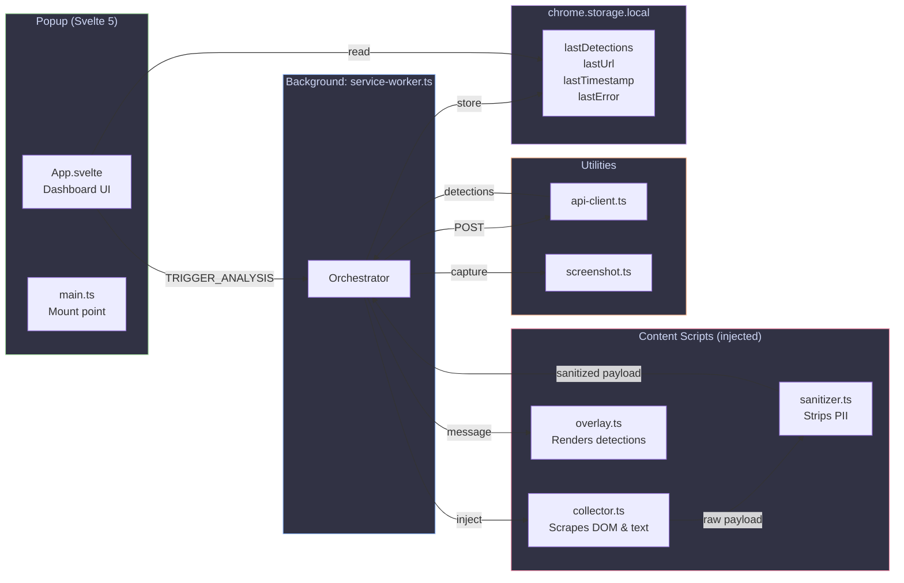
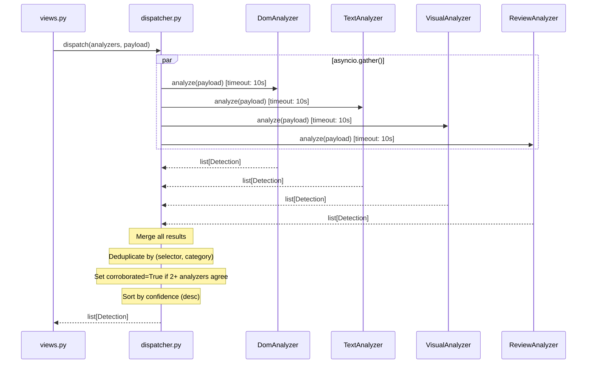

# Architecture

> System-level architecture of DarkGuard showing component relationships, module boundaries, and technology choices.

## High-Level System Architecture

```mermaid
graph TB
    subgraph Browser["Chrome Browser"]
        User["👤 User clicks extension icon"]
        SW["Service Worker<br/><i>Orchestrator</i>"]
        CS["Content Script<br/><i>Collector + Sanitizer</i>"]
        OV["Content Script<br/><i>Overlay Renderer</i>"]
        POP["Popup<br/><i>Svelte 5 Dashboard</i>"]
        STORE["chrome.storage.local"]
    end

    subgraph Backend["Django Backend (stateless)"]
        API["POST /api/analyze<br/><i>DRF ViewSet</i>"]
        DISP["Dispatcher<br/><i>asyncio.gather()</i>"]
        DOM["DOM Analyzer<br/><i>Rules Engine</i>"]
        TXT["Text Analyzer<br/><i>Regex + NLP</i>"]
        VIS["Visual Analyzer<br/><i>ElementMap → LLM</i>"]
        REV["Review Analyzer<br/><i>Heuristics + LLM</i>"]
    end

    subgraph External["External Services"]
        GEMINI["Google Gemini API<br/><i>gemini-2.5-flash</i>"]
    end

    User -->|"action.onClicked"| SW
    SW -->|"chrome.scripting.executeScript"| CS
    SW -->|"chrome.tabs.captureVisibleTab"| SCREENSHOT["📸 Screenshot"]
    CS -->|"Sanitized payload"| SW
    SW -->|"POST JSON"| API
    API --> DISP
    DISP -->|"asyncio.wait_for(10s)"| DOM
    DISP -->|"asyncio.wait_for(10s)"| TXT
    DISP -->|"asyncio.wait_for(10s)"| VIS
    DISP -->|"asyncio.wait_for(10s)"| REV
    VIS -->|"ElementMap prompt"| GEMINI
    REV -->|"Review text prompt"| GEMINI
    DISP -->|"Merged detections"| API
    API -->|"JSON response"| SW
    SW -->|"Store results"| STORE
    SW -->|"Send detections"| OV
    POP -->|"Read results"| STORE

    style Browser fill:#313244,stroke:#89b4fa,color:#cdd6f4
    style Backend fill:#1e1e2e,stroke:#a6e3a1,color:#cdd6f4
    style External fill:#1e1e2e,stroke:#fab387,color:#cdd6f4
```

## Extension Internal Architecture

## Backend Internal Architecture

```mermaid
graph TD
    subgraph DjangoProject["darkguard/ (Django Project)"]
        SETTINGS["settings.py<br/>CORS, DRF, env vars"]
        URLS["urls.py<br/>/api/ → core.urls"]
    end

    subgraph CoreApp["core/ (Core App)"]
        IFACE["interfaces.py<br/>BaseAnalyzer ABC"]
        MODELS["models.py<br/>Detection dataclass"]
        SERIAL["serializers.py<br/>Request/Response"]
        VIEWS["views.py<br/>POST /api/analyze"]
        DISPATCH["dispatcher.py<br/>Fan-out + merge"]
    end

    subgraph Analyzers["Analyzer Apps"]
        DA["dom_analyzer/<br/>service.py"]
        TA["text_analyzer/<br/>service.py"]
        VA["visual_analyzer/<br/>service.py<br/>element_map_builder.py"]
        RA["review_analyzer/<br/>service.py"]
    end

    URLS --> VIEWS
    VIEWS --> SERIAL
    VIEWS --> DISPATCH
    DISPATCH --> DA
    DISPATCH --> TA
    DISPATCH --> VA
    DISPATCH --> RA
    DA -.->|"implements"| IFACE
    TA -.->|"implements"| IFACE
    VA -.->|"implements"| IFACE
    RA -.->|"implements"| IFACE
    DA -->|"returns"| MODELS
    TA -->|"returns"| MODELS
    VA -->|"returns"| MODELS
    RA -->|"returns"| MODELS

    style DjangoProject fill:#1e1e2e,stroke:#89b4fa,color:#cdd6f4
    style CoreApp fill:#1e1e2e,stroke:#a6e3a1,color:#cdd6f4
    style Analyzers fill:#1e1e2e,stroke:#fab387,color:#cdd6f4
```

## Dispatcher Concurrency Model

## Technology Stack

| Layer | Technology | Version | Purpose |
|---|---|---|---|
| Extension UI | Svelte 5 | 5.x | Reactive popup components |
| Extension Build | Vite | 6.x | Fast bundling, 3 entry points |
| Extension Types | TypeScript | 5.7+ | Strict mode, no `any` types |
| Extension Platform | Chrome MV3 | — | Service worker + content scripts |
| Backend Framework | Django | 5.x | URL routing, settings, WSGI |
| Backend API | Django REST Framework | 3.x | Serialization, validation |
| Backend Concurrency | asyncio | stdlib | Parallel analyzer execution |
| AI/ML | Google GenAI (Gemini 2.5 Flash) | — | Visual + review analysis |
| CORS | django-cors-headers | 4.x | Locked to `chrome-extension://*` |

## Module Boundaries

Each analyzer is a **standalone Django app** with its own:
- `__init__.py` — app marker
- `interfaces.py` — payload/result types
- `service.py` — `BaseAnalyzer` implementation
- `serializers.py` — DRF serializers
- `tests/` — unit test suite

This enforces the **modular architecture rule**: concerns are never mixed across analyzers. Adding a new analyzer is done via the `/add-analyzer` workflow.
