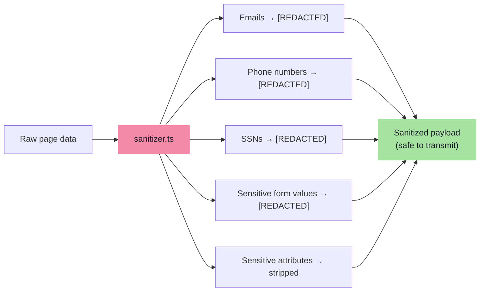

# Privacy & PII Sanitization

> DarkGuard follows a **privacy-first** design: no raw page HTML or screenshots are sent to external APIs without stripping personally identifiable information (PII).

## Principle

All DOM payloads are sanitized **inside the browser** (in the content script) before they ever leave via the service worker. The backend and any LLM APIs only see redacted data.

## What Gets Redacted



### Regex Patterns Used

| Pattern | Regular Expression | Matches |
|---|---|---|
| Email | `[a-zA-Z0-9._%+-]+@[a-zA-Z0-9.-]+\.[a-zA-Z]{2,}` | `user@example.com` |
| Phone | `(\+?1[-.\s]?)?\(?\d{3}\)?[-.\s]?\d{3}[-.\s]?\d{4}` | `(555) 123-4567`, `+1-555-123-4567` |
| SSN | `\b\d{3}-\d{2}-\d{4}\b` | `123-45-6789` |

### Sensitive Form Inputs

The following input types have their `value` and `textContent` redacted:

- `input[type="password"]`
- `input[type="email"]`
- `input[type="tel"]`
- `input[type="number"]` (inside forms)
- `textarea` (inside forms)

### Sensitive Attributes

These attributes are stripped from DOM element metadata:

- `value` (on form inputs)
- `placeholder` (if containing PII patterns)
- `title` (if containing PII patterns)
- `aria-label` (if containing PII patterns)

## Data That IS Sent

The following data is sent to the backend after sanitization:

| Data | Content | Purpose |
|---|---|---|
| Page URL | Full URL of the page | Context for analysis |
| Element selectors | CSS selectors (e.g., `#btn-decline`) | Identifying elements for overlays |
| Tag names | `button`, `a`, `input`, etc. | DOM structure analysis |
| Computed styles | `color`, `background-color`, `font-size`, `opacity` | Visual interference detection |
| Bounding rects | `{x, y, width, height}` | Size disparity analysis |
| Button/heading text | Sanitized text content | Confirmshaming / urgency detection |
| Body text | First 5000 chars (sanitized) | Urgency language scanning |
| Review text | Sanitized review bodies | Fake social proof detection |
| Screenshot | Base64 PNG of visible tab | Visual analyzer (ElementMap only) |

## Data That Is NEVER Sent

- ❌ Raw form input values (passwords, credit cards)
- ❌ Email addresses found on the page
- ❌ Phone numbers found on the page
- ❌ Social Security Numbers
- ❌ Cookies or session tokens
- ❌ `localStorage` or `sessionStorage` contents
- ❌ Authentication headers

## Storage

Analysis results are stored in `chrome.storage.local` (browser-local, never synced):

```typescript
{
  lastDetections: Detection[],  // Array of detection results
  lastUrl: string,              // URL of last scanned page
  lastTimestamp: string,        // ISO 8601 timestamp
  lastError: string | null,     // Error message if analysis failed
}
```

This data is overwritten on each new scan and never persisted to disk or transmitted.
