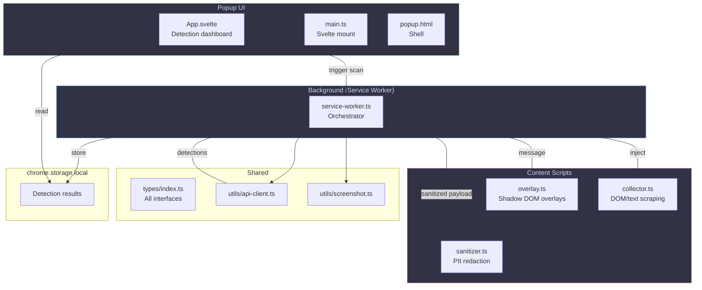

# DarkGuard Extension

> Chrome MV3 browser extension that collects page signals, sanitizes PII, and renders dark pattern overlays.

## Tech Stack

| Component | Technology |
|---|---|
| Language | TypeScript (strict, no `any`) |
| UI Framework | Svelte 5 |
| Bundler | Vite 6 |
| Platform | Chrome Manifest V3 |

## Architecture



## File Guide

| File | Purpose |
|---|---|
| `src/manifest.json` | MV3 manifest — permissions, entry points |
| `src/background/service-worker.ts` | Main orchestrator — receives click, injects scripts, calls API, stores results |
| `src/content/collector.ts` | Scrapes DOM metadata, text, review content from the active tab |
| `src/content/sanitizer.ts` | Strips PII (emails, phones, SSNs) before data leaves the browser |
| `src/content/overlay.ts` | Renders detection overlays using Shadow DOM with severity colors |
| `src/popup/App.svelte` | Svelte 5 popup component — reads storage, shows detection list |
| `src/popup/main.ts` | Svelte mount entry point |
| `src/popup/popup.html` | HTML shell for the popup |
| `src/types/index.ts` | All shared TypeScript interfaces (Detection, payloads, API types) |
| `src/utils/api-client.ts` | `fetch()` wrapper for `POST /api/analyze` |
| `src/utils/screenshot.ts` | `chrome.tabs.captureVisibleTab()` wrapper |

## Permissions

| Permission | Justification |
|---|---|
| `activeTab` | Access the current tab's URL and inject content scripts |
| `tabs` | Query tab info for screenshot capture |
| `scripting` | Inject `collector.ts` programmatically |
| `storage` | Store detection results in `chrome.storage.local` |

No `host_permissions`, `cookies`, `webRequest`, or other sensitive permissions are requested.

## Build

```bash
npm install
npm run build      # Production build → dist/
npm run dev        # Dev mode with hot reload
```

### Build Output (`dist/`)

```
dist/
├── manifest.json           # Copied from src/
├── service-worker.js       # Background script
├── content.js              # Content scripts bundle
├── popup.js                # Svelte popup bundle
├── src/popup/popup.html    # Popup HTML shell
└── assets/
    └── popup-*.css         # Extracted popup styles
```

### CSP Safety

The build output is **MV3 Content Security Policy compliant**:
- ❌ No `eval()` in any bundle
- ❌ No `new Function()` calls
- ❌ No string-based `setTimeout()` / `setInterval()`
- ✅ Svelte 5 compiles to direct DOM operations

## Messaging Protocol

### Extension → Service Worker

```typescript
// Trigger analysis from popup
chrome.runtime.sendMessage({ type: "TRIGGER_ANALYSIS" });
```

### Service Worker → Content Script

```typescript
// Send detections for overlay rendering
chrome.tabs.sendMessage(tabId, {
  type: "RENDER_OVERLAYS",
  detections: Detection[]
});
```

## Overlay Rendering

Overlays use **Shadow DOM** to prevent style conflicts with the target page:

1. A `<div>` host is absolutely positioned over the flagged element
2. A Shadow Root is attached with `mode: "closed"`
3. Isolated CSS applies a severity-colored border
4. A hover tooltip shows category, explanation, confidence, and corroboration status

### Severity Colors

| Severity | Color | Use |
|---|---|---|
| High | `#f38ba8` (red) | Clearly deceptive patterns |
| Medium | `#fab387` (orange) | Likely dark patterns |
| Low | `#89b4fa` (blue) | Potential concerns |
